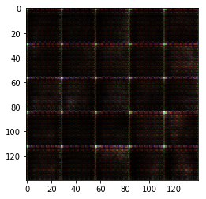
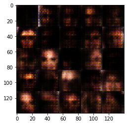
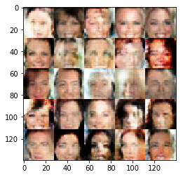
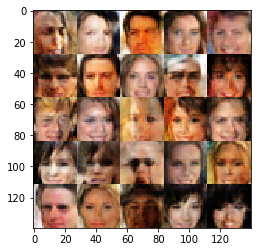
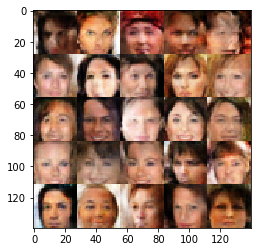

# face_generation

**Deep Learning Foundation Nanodegree Program**  
  
**Project 5 (Generative Adversarial Network):**  
  
**Face Generation**  
  
Please see detail in python notebook (.ipynb)  
  
**Sample Results:**  
  
  
  
  
  
